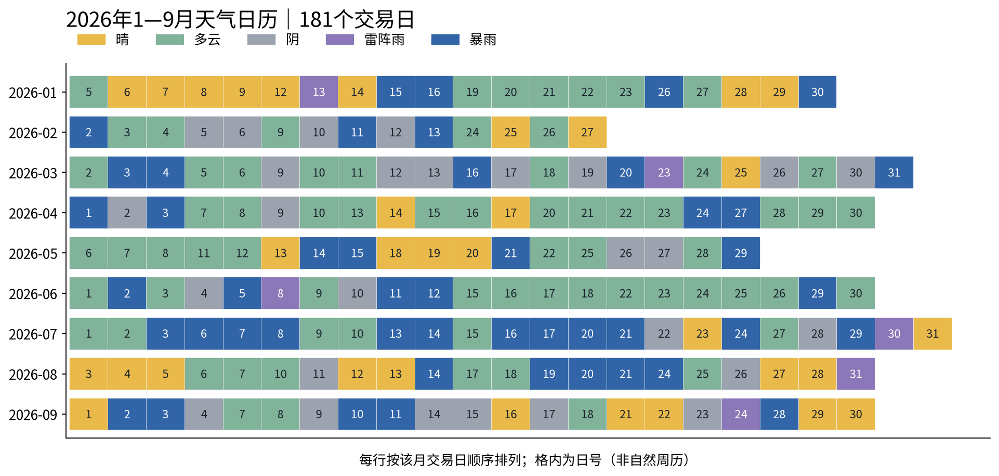
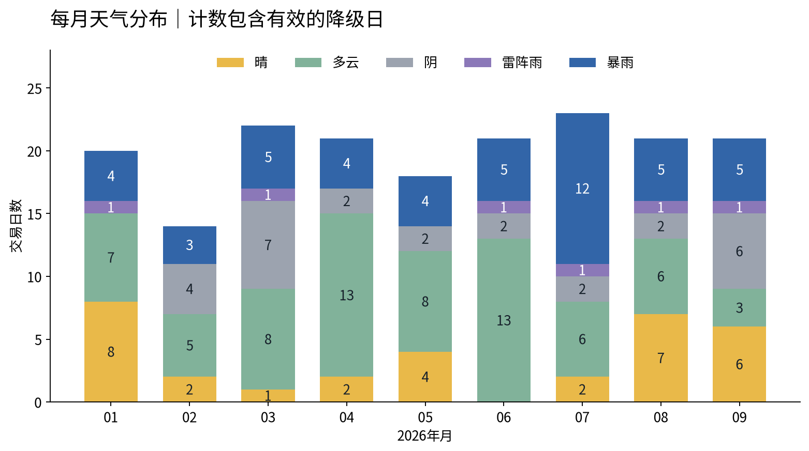
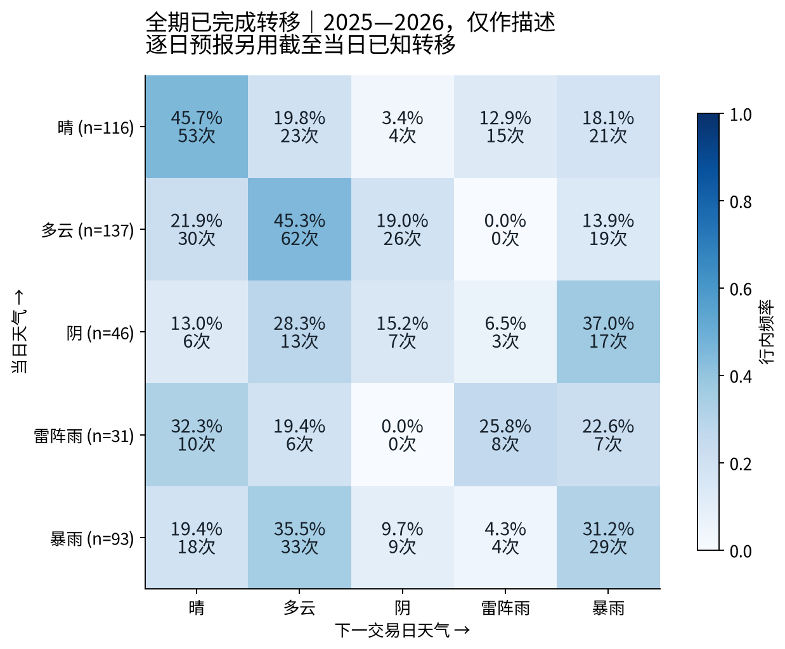

# 大盘天气预报 v0.2

2025-01-02至2026-09-30的424个交易日已完成正式计算：三个读数和天气均为424日；2026年181日均有共同口径下可验证的次日预测。工程计算已验收；2026-10-07按用户授权完成公开方法对照和项目内审，状态为project_review_accepted，人工标注不再是前提。新天气独立于旧周期相位和题材研究，旧五模块接力分仍保留作参考。

我们测量的是三个可以分开的事实：昨日强势股今天受到多大惩罚，强势表现能否晋级并保持梯队，全市场参与是否活跃。各组成项先用2025年P10/P90换算，再按固定权重合成0—100读数；挨打越高表示惩罚越重，延续和活跃越高则分别表示延续更好、参与更活跃。数值是固定标尺下的位置，不是收益或预报概率。

五种天气把这些组合译成便于阅读的标签；天气分支优先描述接力生态：惩罚重而延续弱为暴雨，惩罚重但延续尚在为雷阵雨；挨打未达60且延续达到50为晴；其余按活跃程度区分多云与阴。晴也可能伴随指数下跌或低活跃，不能单凭名称推断普涨。多云可有相当活跃的交易，暴雨也不附操作建议。

## 2026年的环境

| 天气 | 2025标尺期 | 2026年1—9月 | 2026占比 |
|---|---:|---:|---:|
| 晴 | 85 | 32 | 17.7% |
| 多云 | 68 | 69 | 38.1% |
| 阴 | 19 | 27 | 14.9% |
| 雷阵雨 | 25 | 6 | 3.3% |
| 暴雨 | 46 | 47 | 26.0% |

2026平均挨打40.96、延续26.35、活跃48.72；2025分别为41.50、42.99、47.74。突出变化是延续读数下降，不能概括为所有维度都转弱。1月有8个晴日、活跃均值70.08；6月没有晴日、13个多云日，延续均值仅9.60而活跃仍为56.24；7月23日中12日暴雨，挨打均值57.32。这些差别说明，市场有成交与强势股能持续晋级是两件需分别记录的事。

## 次日频率预报有没有超过基准

每个收盘后仅累计此前已完成的相邻交易日转移，包括昨日到今日；再在与今日相同天气的历史起点中计算明日五类频率。2026验证按目标日期归属，包含2025最后一日对2026首日的预测。四种方法共用181个目标日，没有因少样本或降级筛掉困难日期。

| 方法 | 命中/共同样本 | 命中率 |
|---|---:|---:|
| 当时已知转移频率 | 78/181 | 43.09% |
| 明日同今日 | 74/181 | 40.88% |
| 截至当日已知历史众数 | 51/181 | 28.18% |
| 全评价期众数，事后参照 | 69/181 | 38.12% |

频率预报本次超过两个当时可用基准，也超过事后全期众数；相对延续基准只多命中4日，差2.21个百分点。这是有限历史中的描述结果，尚无足够证据称其具有稳定预测优势。没有为赢基准改变阈值、窗口或平滑；也没有连接策略收益。

全424日中有5个起点尚无同类转移、45个起点只有1—9次；零样本概率留空，小样本照常报告。进入2026评价的181个起点均已有至少10次。下面是完整时期的423对转移，供描述；它没有被用于回填逐日预报。

## 与旧接力分、已有复盘的对照

2026年47个暴雨日中，旧分D档41日、C档6日；32个晴日中，旧分S/A共22日。多云分布横跨旧S至D档，说明三读数保留了旧总分会合并掉的信息。[读数分布](figures/04_reading_distributions.png)和[交叉表](figures/05_weather_relay.png)给出完整对照。

8月31日是关键算例。正式挨打63.78、延续68.68、活跃62.19，归为**雷阵雨**，并非云端近似计算的晴。昨日涨停80只中今日大跌15只；昨日连板17只中大跌5只。两项平滑后为18.40%、27.72%，标准化为68.94、69.25；跌停密度项47.86，合成挨打63.78。晋级项59.19、六档完整度项100、空间高度项50又使延续保持68.68；活跃的成交比、上涨占比、涨停密度项分别为35.06、63.60、96.95。

已有复盘写“指数修复，但短线情绪并没有同步转暖”；正式结果同时识别了梯队尚在与昨日强势股受罚，和这句话强调的分化更接近。这里没有为匹配复盘改规则，旧接力分仍为45.70/C。2025-04-07正式为暴雨，挨打91.09、延续4.62；其本地旧资料是历史机器日序列，不能冒充两位标注者意见。其余已有聊天日期的原话、来源和临时对照另存附件，不进入正式人工一致率。

## 可继续使用的成果与边界

交付留下逐日环境记录、稳定字段和可追溯版本；以后可按日期与策略账本连接，检验不同环境的差异，目前未得到策略结论。主控已核查旧分原样、独立校准、真实事件输入三前缀、逐项算例、重复运行、截断统计及图表数字；[日表](data/mkt_daily.csv)、[复刻与今天命令](REPRODUCE.md)、[李老师10日盲标包](human/li10/packets/)可直接使用。

局限集中如下：2025是回顾性标尺，2026已被项目研究使用；分位截断会饱和，例如2026跌停密度41日严格高于P90、涨停密度49日高于P90，已逐项统计。昨日群体共有76个停牌成员、2个缺报价成员，分别保留分母缺口；2025另有26个股票日的上市身份不足被F1排除。所有日三读数组成项均可计算，但源与群体质量使2025有62日、2026有28日标为DEGRADED，仍进入统计。稳定本地日历止于9/30，该日下一交易日日期暂空、概率仍给出，不冒称已有未来验证。名称和既有复盘的精确首发时点未认证。

2026-10-07用户决定不再等待李老师标注，改由项目搜索公开方法并自行判断。总控已接受当前版本作为描述工具，人工模板与原15张随机卡片保留可选；三个读数修订次数仍均为0。原库补数后的181日旧F1分数及档位已另行精确核对。当前发布仍用已验收派生输入，原库在10月7日的无凭证预检明确报calendar_horizon_insufficient；自动挂接仍为ready_not_enabled，不把快照运行当作无人干预运行。

## 10月7日项目内审与解释增强

已查阅五项原始研究，关键比较及取舍见[公开方法对照](METHOD_REVIEW_R4.md)，逐日判断见[十日项目内审](CASE_REVIEW_R4.md)。与本项目最接近的A股日频研究同样观察昨日强势股反馈及连板高度；这支持相关代理具有可解释性。三读数、权重、固定标尺及天气切点继续采用项目定义。

本轮为全部424日生成[事实解释与诊断](data/review_r4/)，并核对每一项贡献之和。2026年延续与活跃相关系数0.244，指数方向与上涨广度分歧45日，说明分别呈现具有实际价值。四个天气切点逐一±3分的八个诊断中，单次最多改变8/181日（4.42%）；所有变体均保留，未按命中率挑选。历史读数、天气、预报及2025校准完全不变。

内审新增小群体分母、零群体缺失、标尺饱和和广度分歧解释。解释由总控编写后确定性生成，每日无需再请人填卡，也无需在线模型。代码测试、真实事件前缀、重复运行和数据非修改证据见[最终验收](acceptance/revision_r4_controller.json)。

## 10月5日使用体验修订

原[15张随机事实卡](human/packets/cards.pdf)已作为可选资料保留；此前使用[李老师10日乱序卡片](human/li10/packets/cards.pdf)，每张10项事实，并排给出2025 P10、中位数和P90；不附机器读数、天气答案或分类切点。原随机卡片及历史模板保留，不再要求填写；新标签表仅李老师一份。日表新增“临界”描述：当日有效判断分支距边界严格小于3分时，提示跨越后的天气；424日有62日提示，2026为30日。原346列计算结果逐值完全不变。

“今天”不再强制完成凭证；缺凭证时核对三库截止日、未完成残留和3分钟静置，通过后输出并标“未附凭证”。普通质量告警不拦截。现存LIVE残件及交易日历止于9/30已如实记录；下一交易日等待数据统一补齐日历，不在天气端另行推算。
