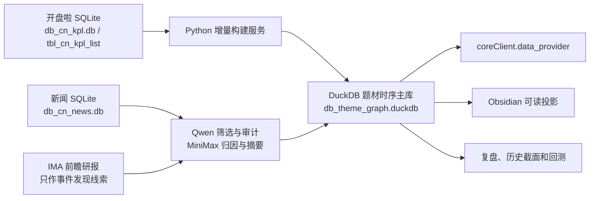

# 题材研究数据库工具

## 1. 定位

“题材研究数据库工具”是 TradingAgent 中面向 A 股涨停题材研究的时序知识库。它把开盘啦每日涨停榜转换为可追溯、可按历史时点查询、可增量更新的题材—股票关系数据，并把题材热度、生命周期、新闻催化分析和证据审计沉淀到同一套结构中。

它解决四类问题：

1. 某个题材当天和历史上有哪些实际涨停股；
2. 题材的宽度、高度、梯队、封板质量、热度和生命周期如何变化；
3. 同一题材经历过哪些独立炒作周期，每轮可能由什么事件驱动；
4. 如何让后续研究复用已经完成的归因和证据，不重复调用模型挖掘同一批信息。

本工具不直接给出买卖点、仓位或自动交易指令。它提供可回测的每日题材情绪、热门题材、主线结构和龙头候选；最终逻辑确认与交易判断仍由上层题材研究流程完成。

## 2. 技术架构



| 层级 | 技术 | 职责 |
|---|---|---|
| 原始数据层 | SQLite | 保存开盘啦、新闻等原始数据，不由题材工具改写 |
| 时序知识层 | DuckDB | 保存实体、涨停事实、时序关系、日度热度、周期和模型审计结果 |
| 分析层 | Python、Pandas、SQL、Qwen、MiniMax | 增量构建、指标计算、新闻筛选、归因、审计与摘要 |
| 展示层 | Obsidian Markdown | 人类可读的题材页面、周期表、证据索引和人工研究入口 |

当前没有使用 Neo4j。题材和股票作为实体，涨停归因作为关系，交易日期和有效期作为时间，通过 DuckDB 的事实表与关系表表达“图”。这种结构更适合当前大量按日期、题材、股票执行的聚合、历史回放和批量评分。

## 3. 路径

| 内容 | 默认路径 |
|---|---|
| 题材知识主库 | `offlineDataManager/data/db_theme_graph.duckdb` |
| 开盘啦原始库 | `offlineDataManager/data/db_cn_kpl.db` |
| 新闻原始库 | `offlineDataManager/data/db_cn_news.db` |
| Schema 与存储实现 | `offlineDataManager/scripts/core/theme_graph_store.py` |
| 增量和回填服务 | `offlineDataManager/scripts/service/service_theme_graph.py` |
| Obsidian 渲染器 | `offlineDataManager/scripts/core/theme_vault.py` |
| 每日题材复盘规则 | `offlineDataManager/scripts/core/theme_daily_review.py` |
| 全市场题材周期图 | `plot/plot_market_theme_cycle.py` |
| 单题材周期图 | `plot/plot_single_theme_cycle.py` |
| 统一查询接口 | `coreClient/data_provider.py` |
| 催化分析程序 | `policyStudy/policy/题材涨停研究/theme_graph/` |
| 催化分析产物 | `outputs/theme_catalyst_analysis/<episode_id>/` |
| IMA线索接入 | `policyStudy/policy/题材涨停研究/theme_graph/ima_evidence_source.py` |
| Obsidian 投影 | `~/Documents/Obsidian Vault/A股题材知识库` |

数据库和 Obsidian 路径分别可以通过 `TRADING_AGENT_THEME_GRAPH_DB_PATH` 与 `TRADING_AGENT_THEME_VAULT_ROOT` 环境变量覆盖。

## 4. 数据口径

第一版严格以 `db_cn_kpl.db / tbl_cn_kpl_list` 为主源：

- `lu_desc` 是当日主归因题材；
- `theme` 拆成辅助标签；
- `tag=涨停` 是正式涨停事件；
- `tag=炸板` 用于题材封板质量和反证；
- 同花顺等外部数据只作为参考证据，不能静默覆盖开盘啦主归因。

股票范围：

- 正式股票维表只收入至少有一次实际涨停的股票；
- 炸板股票参与炸板率等指标，但仅有炸板不会成为正式历史涨停成员；
- 当前不使用 `tbl_cn_kpl_concept_cons` 全量普通成分；
- 当前不使用“涨幅大于7%”扩展池；
- 未来普通产业成分应写入独立 membership 层，不能污染涨停股口径。

时间原则：

- 历史查询必须使用 `as_of` 或明确截止日期；
- 日度热度和当日生命周期只使用当日及以前数据；
- 周期最终结束日属于事后分段信息，不能倒灌到历史决策；
- 新闻证据按最早可见时间判断，盘后异动稿不能倒写为盘中启动原因。

## 5. 数据库结构

Schema 版本当前为 `1.0.0`。

### 5.1 实体与分类

| 表 | 主键 | 内容 |
|---|---|---|
| `dim_theme` | `theme_id` | 主归因题材、辅助标签和事件分支；稳定ID为 `T-NAME-{name sha1}` |
| `theme_alias` | `theme_id, alias, source, valid_from` | 别名、来源、有效期和置信度 |
| `dim_theme_taxonomy` | `theme_id` | 一级、二级分类、交叉归属、理由、版本和复核状态 |
| `dim_stock` | `ts_code` | 至少实际涨停过一次的股票及首次、最近涨停日期 |

一个二级题材只有一个主一级归属，`secondary_level1_json` 可保存交叉归属。当前234个主归因题材映射到30个一级题材。

### 5.2 涨停事实与关系

#### `fact_limit_event`

每只股票每个交易日的一次涨停或炸板事实，主键为 `event_id`。保存日期、股票、涨停或炸板、连板数、周期板数、板高度、封板时间、开板时间、主辅题材、封单、成交额、换手率、流通市值、快照时间、来源和行哈希。

#### `rel_limit_theme`

连接事件与题材：

- `primary`：正式涨停事件到 `lu_desc` 主归因题材；
- `auxiliary`：事件到 `theme` 辅助标签；
- 保存权重、置信度、证据源和历史有效时点；
- 主键为 `event_id + theme_id + attribution_role`。

`fact_membership_snapshot` 和 `rel_theme_stock_membership` 为未来普通成分扩展预留，当前保持为空，不能用于当前涨停宽度计算。

### 5.3 日度状态与炒作周期

#### `fact_theme_daily`

主键为 `trade_date + theme_id`，保存：

- 涨停数、炸板数；
- 最大板高度、首板数、连板数、梯队积分；
- 封板率、早盘封板比例、五日持续性；
- 距离上次活跃天数；
- 热度分、120日热度百分位；
- 试探、启动、发酵、加速、高潮、分歧、延续、退潮等程序化阶段；
- 所属周期 ID 和构建运行 ID。

阶段标签用于排序和研究，不是已经校准的预测真值。

#### `fact_theme_episode`

主键为 `episode_id`，保存周期起点、最近活跃日、结束日、峰值日、峰值热度、峰值宽度、活跃交易日数、状态、切分方法和计算时点。当前切分允许中间最多一个无活跃记录的市场日；二波和新旧催化关系仍需证据判断。

### 5.4 模型与证据

#### `llm_analysis`

模型只能向该审计表写结果，不能覆盖开盘啦事实。保存分析对象、分析类型、历史有效时点、provider、model、提示词版本、输入哈希、结构化输出、证据、置信度、复核状态和创建时间。

主要分析类型：

- `catalyst_screening`：Qwen逐条筛选新闻；
- `catalyst_extraction`：MiniMax综合主因、竞争解释和叙事演化；
- `catalyst_audit`：Qwen检查引用、时序、因果和分类；
- `episode_summary`：MiniMax生成周期摘要。

`source_conflict` 保存开盘啦主源与外部参考源之间的字段冲突。

### 5.5 每日题材复盘派生层

`theme-market-review-v2` 不新增事实表，而是按指定交易日从 `fact_theme_daily`、`fact_limit_event`、`rel_limit_theme` 和题材分类实时生成历史截面：

- 题材情绪原始值：当日前三题材热度按 50%/30%/20% 加权；
- 题材情绪分：原始值在截至当日最近120个交易日中的百分位，映射为0—100；
- 情绪级别：高热、偏高、中性、偏低、低迷；
- 市场结构：主线明确、多主线、主线替换、热点分散无明确主线、热点低迷无主线；
- 热门题材：按当日热度排序，同时展示宽度、炸板、高度、封板率、阶段和前日排名变化；
- 龙头梯队：只在当日主归因涨停股中，先按板高分层；同板高内再按近20个市场日涨停频次40%、封板时间20%、封单/自由流通盘20%、成交额20%排序龙一至龙三。高一板不会被低一板的成交额或历史人气反超。

情绪分衡量“当天前三题材相对历史是否热”，市场结构衡量“热点是否集中成主线”，二者必须分开解读。多主线按一级题材聚合后判断，避免把芯片与元器件误算成两条独立主线；同一一级题材内部的分支切换也不记作主线替换。所有计算只读取指定日及以前数据。ST板块、ST摘帽、次新股和一级分类“ST与次新”不进入分母、排名或模型批次。

### 5.5 增量、恢复与审计

| 表 | 作用 |
|---|---|
| `source_day_manifest` | 每个交易日的行数、内容哈希和最大快照时间 |
| `source_checkpoint` | 处理断点和最近成功运行 |
| `graph_build_run` | 每次增量、回填、重建的范围、状态和统计 |
| `dirty_entity_queue` | 源数据变化后待重算的题材 |
| `graph_meta` | Schema版本等元信息 |

## 6. 当前数据快照

以下是2026-09-28检查主库得到的快照。模型批次运行期间，`llm_analysis` 会继续增长。

| 指标 | 数量 |
|---|---:|
| 数据范围 | 20260105—20260924 |
| 有数据交易日 | 177 |
| 正式涨停事件 | 14,778 |
| 炸板事件 | 5,300 |
| `fact_limit_event` 总行数 | 20,078 |
| 实际涨停股票 | 3,330 |
| 题材节点总数 | 686 |
| 主归因题材 | 234 |
| 一级题材 | 30 |
| 事件—题材关系 | 44,549 |
| 题材日度记录 | 10,002 |
| 炒作周期 | 4,495 |
| 模型分析记录 | 463，持续增长中 |

686个题材节点包含主归因题材、辅助标签和事件分支，不等于686个独立主线题材。一级、二级分类和 Obsidian 正式题材页以234个 `lu_desc` 主归因题材为准。

## 7. 统一查询接口

业务研究优先通过 `coreClient.data_provider` 查询：

```python
from coreClient.data_provider import (
    get_theme_profile,
    get_theme_members,
    get_theme_daily,
    get_market_theme_review,
    get_market_theme_review_series,
    get_theme_cycle_data,
    get_theme_analyses,
    get_theme_taxonomy,
    get_stock_theme_history,
)

profile = get_theme_profile(name="商业航天", as_of="20260924")
members = get_theme_members(profile["theme_id"], as_of="20260924")
events = get_theme_members(profile["theme_id"], as_of="20260924", historical=True)
timeline = get_theme_daily(profile["theme_id"], "20260101", "20260924")
market_review = get_market_theme_review("20260924", top_n=10, leader_count=3)
market_cycle = get_market_theme_review_series("20260105", "20260924")
theme_cycle = get_theme_cycle_data(name="商业航天", start_date="20260401", end_date="20260731")
analyses = get_theme_analyses(theme_id=profile["theme_id"])
taxonomy = get_theme_taxonomy(level1_name="半导体")
stock_history = get_stock_theme_history("000001.SZ")
```

研究已有周期时必须先查询 `get_theme_analyses()`。只有新周期、源数据修订、用户要求重做，或现有结果明确缺少关键证据时才重新调用模型或联网搜索。

## 8. 构建与维护

```bash
# 每日增量，默认从断点回看七天
.venv/bin/python offlineDataManager/scripts/service/service_theme_graph.py \
  --mode incremental

# 指定日修复
.venv/bin/python offlineDataManager/scripts/service/service_theme_graph.py \
  --trade-date 20260924 --force

# 历史回填
.venv/bin/python offlineDataManager/scripts/service/service_theme_graph.py \
  --mode backfill --start-date 20250101 --end-date 20251231

# 完全重建指定范围
.venv/bin/python offlineDataManager/scripts/service/service_theme_graph.py \
  --mode rebuild --start-date 20260101 --end-date 20260924
```

服务比较源日行数和内容哈希，无变化日期跳过；变化日期替换事实，受影响题材进入脏队列并重新计算。文件锁防止两个 DuckDB 写进程并发。历史按时间正序回填，不能用后来的别名、分类或新闻结论改写更早时点可见事实。

`rebuild` 会删除目标 DuckDB 后重建，属于高影响操作。执行前需要确认范围、备份和 `llm_analysis` 等研究成果的保留方案，日常更新不使用该模式。

## 9. Obsidian 投影

默认目录为 `~/Documents/Obsidian Vault/A股题材知识库`：

```text
A股题材知识库/
├── 00_首页/
├── 01_题材/          # 30个一级文件夹和234个二级题材页
├── 04_股票/          # 按需建档，不批量生成3330只股票文档
├── 06_每日复盘/
├── 07_证据/
├── 09_待确认/
└── _generated/       # 可由DuckDB重建的自动内容
```

DuckDB 是主库，Obsidian 是可读投影。不从 Obsidian 反写事实；`_generated` 可以重建；题材人工研究区不会被渲染器覆盖；股票文档按研究需要创建；周期保留在题材页中；模型结果必须显示复核状态、证据和未解决项。

`06_每日复盘/YYYYMMDD.md` 是人工复盘入口，嵌入 `_generated/daily/YYYYMMDD__dashboard.md`。自动页固定展示题材情绪分、市场结构、热门题材前十、每个题材龙一至龙三以及完整热度表。人工复盘内容不会被自动覆盖。

### 9.1 模型盲审与批量扩展

确定性规则先生成事实和候选标签，Qwen 3.8 与 MiniMax 只做冻结截面的独立盲审：模型只能看到当日和前一交易日，不能看到程序标签或未来行情。标准脚本为：

```bash
THEME_VLLM_TRANSPORT=ssh \
THEME_VLLM_MODEL=/home/sysadmin/data/disk02/jc/models/qwen3.8-27b-fp8 \
PYTHONPATH=offlineDataManager/scripts:. \
.venv/bin/python -m policyStudy.policy.market_review.evaluate_theme_structure \
  --providers both --chunk-size 8
```

每个子批最多8天，逐批检查日期完整性、结构枚举和置信度，再合并结果。输出保存在 `outputs/theme_daily_review_validation/`。批量生产建议由 Qwen 做全量初审，MiniMax抽样复核低置信和分歧样本；模型意见不覆盖程序分数，也不直接改写 DuckDB 事实。抽样一致率只能作为规则审计指标，不能冒充对市场真值的准确率。

## 10. 催化归因约束

1. “某股涨停、板块拉升、概念异动”是行情结果，不能单独作为启动原因；
2. 外部证据必须保存原始 URL、标题、来源、发布时间、抓取时间和对应行情日期；
3. 搜索结果摘要不能单独作为证据；
4. 保留竞争解释和置信度，证据不足时保留 `no_reliable_reason`；
5. 本地和外部证据都要经过筛选、综合和时序/引用审计；
6. ST板块、ST摘帽和次新股不进入当前题材催化研究批次，但底层原始涨停事实可以保留用于审计。
7. IMA“前瞻研报团队（每日更新）”用于发现事件线索。研报标题、搜索片段和无法读取的共享文件不是因果证据；必须继续找到并打开原始网页，保存 URL 和历史可见时间。

### 10.1 联网补证的模型分工和续跑

`research_external_evidence_batch.py` 的默认链路如下：

1. 读取周期的 `09_web_research_request.json`；
2. 从 IMA 检索题材名，用标题日期筛选检索窗口内候选，结果缓存到 `09_ima_research_leads.json`；
3. Hermes/MiniMax根据IMA线索和题材关键词联网打开原文，生成 `10_web_evidence.json`；
4. Qwen筛选外部证据，MiniMax综合归因，Qwen审计时间与引用，MiniMax生成周期摘要；
5. 写入 DuckDB `llm_analysis`，再由渲染器投影到 Obsidian 题材页的“炒作周期”表。

IMA不可用或达到当日资料获取上限时，状态会缓存为 `unavailable` 或 `quota_exhausted`，当次自动继续Web检索，达到重试日期后可重新搜索。批次会复用已经生成的外部证据；若只有模型原始输出，则先尝试重新解析和标准化，避免再次调用MiniMax。单条URL、字段或日期不合格时只剔除该条并记录原因，不让同一题材的其他合格证据一起失败。

## 11. 验收清单

构建后检查：

- `source_checkpoint.max_trade_date` 等于预期最新交易日；
- `source_day_manifest` 日期数与源库交易日一致；
- 最近一次 `graph_build_run.status` 为 `success`；
- `dirty_entity_queue` 没有异常长期 `pending`；
- 当日涨停、炸板和题材关系数与源库一致；
- 同一输入重复运行时变化日期数为0；
- 无数据变化时 Obsidian 二次渲染 `files_written=0`。

催化分析后检查：

- `llm_analysis` 有对应周期的筛选、归因、审计和摘要；
- 证据 ID 可以追溯到候选新闻或外部原文；
- 发布时间不晚于其声称解释的行情节点；
- 归因状态、置信度和待复核项已投影到相应题材页；
- 模型完成、数据库写入和 Obsidian 写入分别核对，不能相互代替。

## 12. 相关实现

- Schema：`offlineDataManager/scripts/core/theme_graph_store.py`
- 构建服务：`offlineDataManager/scripts/service/service_theme_graph.py`
- Obsidian渲染：`offlineDataManager/scripts/core/theme_vault.py`
- 统一接口：`coreClient/data_provider.py`
- 题材分类：`policyStudy/policy/题材涨停研究/theme_graph/taxonomy/`
- 催化分析：`policyStudy/policy/题材涨停研究/theme_graph/`
- 代码级详细设计：`offlineDataManager/docs/代码详细设计/theme_graph.md`
- 测试：`offlineDataManager/scripts/core/test_theme_graph_store.py`
